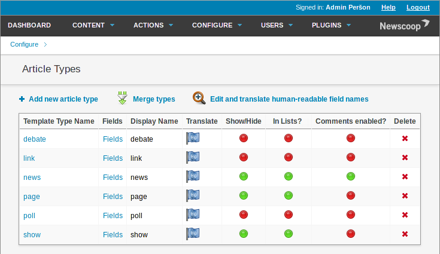
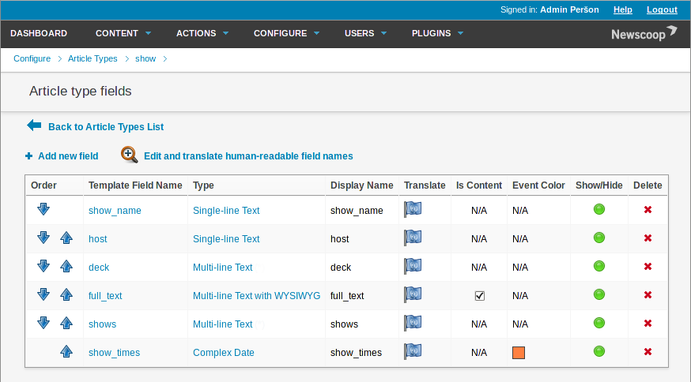

Broadcaster - a theme for Newscoop
==================================

Broadcaster is a theme for the [Newscoop](http://www.sourcefabric.org/en/newscoop/) content management system from [Sourcefabric](http://www.sourcefabric.org/). The design is by Pete Haughie, based on the [Rockstar](https://github.com/newscoop/theme-Rockstar) theme by Stephanie Miebach and Christian Kobben.

The distinctive feature of this theme is the integration with the [Airtime](http://www.sourcefabric.org/en/airtime) broadcast automation system. There are widgets for stream playback and display of the schedule fetched via the Airtime API from your broadcast station, as well as Article Types designed for a typical station with an article for each show in the schedule. The [Broadcaster theme demo](http://broadcaster.lab.sourcefabric.org/) site uses sample data from [Sourcefabric Radio](http://radio.sourcefabric.org/).

Like Newscoop, the 'Broadcaster' theme is &copy; Sourcefabric 2013 and released under the [GNU General Public License, version 3](https://www.gnu.org/licenses/gpl.html).

Important: If you go to the theme page and not to the release page, the 'Download this repository as a zip file' button on GitHub exports Newscoop theme files within a folder, whereas a working Newscoop theme should have its main template files in the zip file root. Please always take the file from the release page directly to get the correct file structure
Any Newscoop theme should have its main template files in the zip file root. 

How to install
==============

First, install Newscoop as shown in the [Newscoop user manual](http://sourcefabric.booktype.pro/newscoop-42-for-journalists-and-editors/system-requirements/). You do not need to install a sample site, as the dummy content is not required for production use.

The Newscoop administration interface includes a theme management and template editing tool, which you can find by clicking Configure on the main navigation menu, then Themes. A new theme can be added to Newscoop by clicking the **Import theme** button on the **Theme management** page. This action opens a dialog box which enables you to select a theme file from your computer. Click the **Browse button** to locate the theme's zip file, then click the **Import** button. Newscoop should report that the import was successful. The new theme should now be displayed in the table on the Theme management page.

Setting up Article Types
========================

The Broadcaster theme uses several *Article Types* to display content in different ways. Each Article Type has specific fields of various kinds. The *news* and *page* Article Types are standard in Newscoop, but the Broadcaster theme uses additional custom Article Types. These are the Article Types required, and the fields they should contain:

1. news (standard Article Type):
   * highlight (switch) - to promote the article in lists
   * deck (Multi-line Text with WYSIWYG) - page description in meta and Open Graph tags
   * full_text (Multi-line Text with WYSIWYG) - body text for the article

2. page (standard Article Type):
   * full_text (Multi-line Text with WYSIWYG) - body text for the article

3. Player (custom Article Type):
   * player (Single-line Text) - used for the stream player widget

4. show (custom Article Type):
   * show_name (Single-line Text) - the name of the show
   * host (Single-line Text) - the presenter of the show
   * deck (Multi-line Text) - page description in meta and Open Graph tags
   * full_text (Multi-line Text with WYSIWYG) - body text for the article
   * shows (Multi-line Text) - for SoundCloud links if you have them
   * show_times (Complex Date) - dates of the show in question

5. Program_Grid (custom Article Type):
   * program_grid (Multi-line Text) - used for the program grid widget

6. Site_Info (custom Article Type):
   * Facebook (Single-line Text) - Facebook name of your station
   * Twitter (Single-line Text) - Twitter name of your station
   * Address (Multi-line Text with WYSIWYG) - street address of your station

7. Stream_Info (custom Article Type):
   * API (Single-line Text) - URL of your Airtime server (default: http://sourcefabric.airtime.pro)
   * stream  (Single-line Text) - URL of your streaming server (default: http://sourcefabric.out.airtime.pro)
   * stream_a (Single-line Text) - mount point of your first stream (default: sourcefabric_a)
   * stream_b (Single-line Text) - mount point of your second stream (default: sourcefabric_b)
   * port (Single-line Text) - Port used by your stream (default is: 8000)

In the Newscoop administration interface, click **Configure** on the main navigation menu, then **Article Types**. If the Article Types shown above are not listed, you will have to create them, as shown in the manual chapter [Article Types](http://sourcefabric.booktype.pro/newscoop-42-for-journalists-and-editors/article-types/). Then the list of Article Types should look like this:

Within the custom Article Type of *show*, the fields should look like this:

Static articles and news
========================

Typically you will want to have some static pages such as 'About us' or 'Contribute' on your Newscoop site. The Broadcaster theme accommodates this desire, so that links to articles in your first issue and section appear in the left side of the page header. For example, your first issue could be called *static* and contain a section called *pages*, although you can name this issue and section anything you want. It does not matter if you use the *news* or *page* Article Type for this type of article, but only *news* articles show up in the RSS feed by default.

More topical content should be placed in second and subsequent issues. These articles are handled differently, with the **Latest News** articles displayed on the homepage. Up to four featured articles are given the most prominent treatment on the homepage, rotating in a carousel. These articles need to be placed in a Featured Article List named *Carousel-en*, where *-en* is the language code for English content. For more information on Featured Article Lists, see the manual chapter [Managing Content](http://sourcefabric.booktype.pro/newscoop-42-for-journalists-and-editors/managing-content/).

Section and article numbers
===========================

The Broadcaster theme uses the section number to provide different treatments to specific sections. The default issue 1, for static content, contains three sections:

* 5 	Pages
* 10 	Application pages
* 50 	RSS placeholder

The Section Template for the RSS placeholder must be set to rss.tpl for the RSS feed to be rendered correctly.

Within the special section *Application pages* there are four articles, with the following Article Types:

1. player (Player)
2. Program Grid (Program_Grid)
3. Site Info (Site_Info)
4. Stream Info (Stream_Info)

By default, issue 10 contains two sections:

* 60 	News
* 100 	Shows

The News section includes articles of type *news* and the Shows section includes articles of type *shows*, as you might expect.

These are only the default behaviours, as like all Newscoop themes, Broadcaster can be customised to be what you need it to be.

Further reading
===============

The reference text for developing Newscoop themes is the [Newscoop Cookbook](http://manuals.sourcefabric.org/). If you would like to contribute your tips and tricks to this book, please [contact Sourcefabric](http://www.sourcefabric.org/en/about/contactus/).
